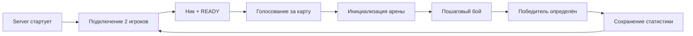

<div align="center">


<br/>


</div>

---

## ✨ Что это

**WORMS-GAME** — это пошаговая PvP-игра на 2 игроков в духе Worms:

- подключение клиентов к серверу по TCP;
- выбор карты голосованием перед матчем;
- смена ходов с ограничением времени;
- разрушаемый рельеф + платформы;
- несколько видов оружия и кулдауны;
- таблица лидеров, которая сохраняется между матчами.

---


## 🧠 Core gameplay loop



---

## 🎮 Управление

| Действие | Клавиши / мышь |
|---|---|
| Движение | `A/D` или `←/→` |
| Прыжок | `W`, `↑` или `Space` |
| Смена оружия | `1..5` |
| Выстрел | Зажать ЛКМ (заряд) → отпустить ЛКМ |

Для `AIRSTRIKE` при выстреле используется целевая позиция по X.

---

## 🛠️ Оружие

| Weapon | Название |
|---|---|
| `PISTOL` | Пистолет |
| `RIFLE` | Автомат |
| `BAZOOKA` | Базука | 
| `GRENADE` | Граната | 
| `AIRSTRIKE` | Воздушный удар | 

> Параметры урона/скорости/кд задаются на стороне сервера в enum оружия.

---

## 🗺️ Карты

Игроки голосуют за одну из трёх карт:

- `CLASSIC_ARENA`
- `DESERT_CANYON`
- `ICE_FORTRESS`

Если голоса разные — сервер выбирает одну из двух случайно.

---

## 🧱 Архитектура

```text
src/main/java/ru/itis/dis403
├── client
│   ├── GameClient                 # входная точка клиента
│   ├── net/                       # сокеты + серверный listener
│   ├── model/                     # view-модели
│   └── ui/                        # Swing: меню, панель игры, рендеры, input
├── common
│   ├── protocol/                  # Packet, PacketIO, MessageType
│   ├── WeaponType / MapType       # enum игрового домена
│   └── Constants                  # host/port/размеры/физика
└── server
    ├── GameServer                 # входная точка сервера
    ├── GameEngine                 # главный цикл + обработка пакетов
    ├── manager/                   # ходы, голосование, сериализация
    ├── physics/                   # физика игроков/пуль/снарядов
    ├── model/                     # сущности сервера
    └── storage/                   # персистентная статистика игроков
```

---

## 🔌 Сетевой протокол

### Формат пакета

- `byte type`
- `int payloadLength`
- `byte[] payload (UTF-8)`

### Группы сообщений

- **Лобби/подключение**: `ASSIGN_ID`, `LOBBY_WAIT`, `REGISTER_PLAYER`, `PLAYER_READY`
- **Матч**: `START_TURN`, `UPDATE`, `END_GAME`
- **Карта**: `VOTE_MAP`, `MAP_SELECTED`, `INIT_MAP`, `MAP_UPDATE`, `INIT_OBJECTS`, `OBJECTS_UPDATE`
- **Действия**: `MOVE`, `MOVE_STOP`, `JUMP`, `SELECT_WEAPON`, `SHOOT`
- **Статистика**: `LEADERBOARD_REQUEST`, `LEADERBOARD_RESPONSE`

---


## 🏆 Статистика и лидерборд

Сервер сохраняет статы в файл:

```text
server_players_stats.json
```

Сохраняются:

- победы / поражения;
- общее число выстрелов;
- попадания и точность;
- сортировка игроков по победам.

---


## 🛣️ Roadmap

- [ ] Матчмейкинг / комнаты
- [ ] Боты
- [ ] Replay матчей
- [ ] Больше оружия и модификаторов
- [ ] Docker + CI

---

<div align="center">


</div>
